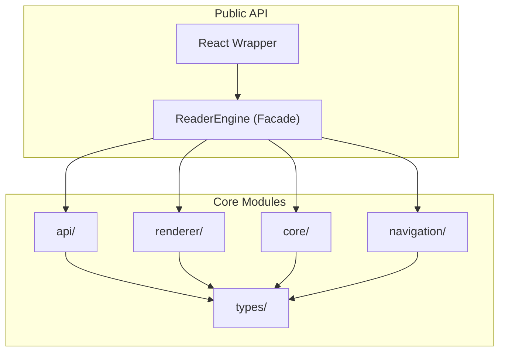
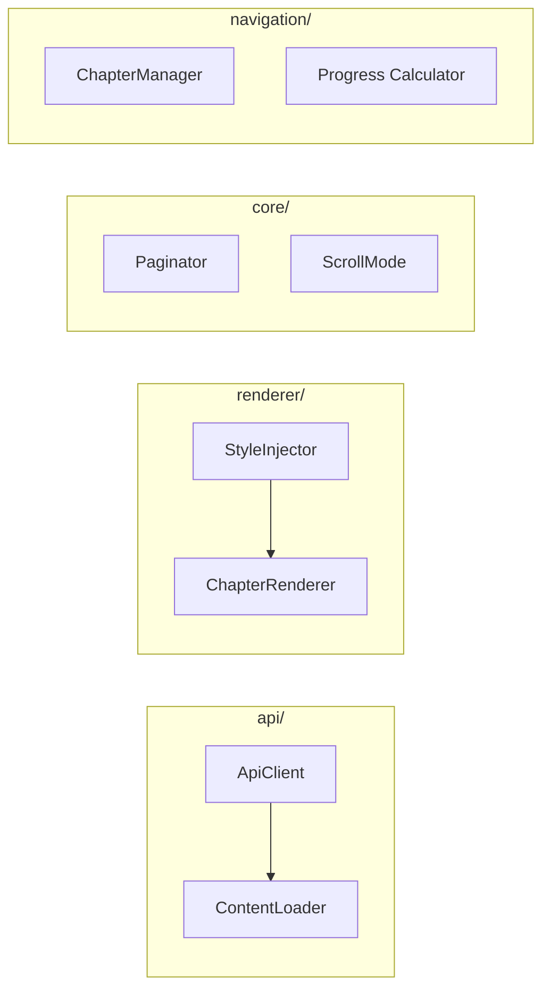
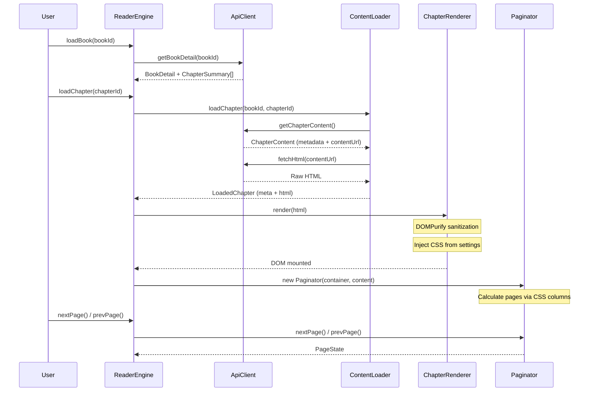
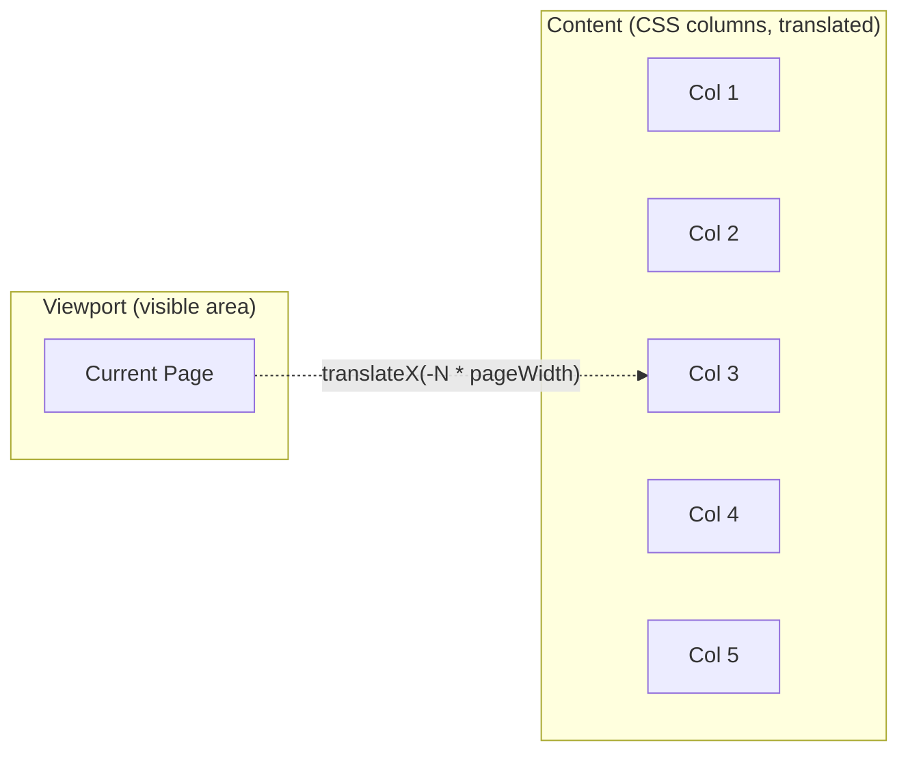
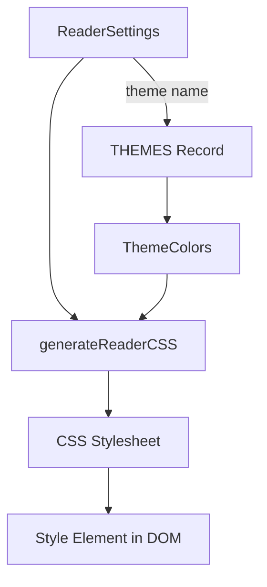
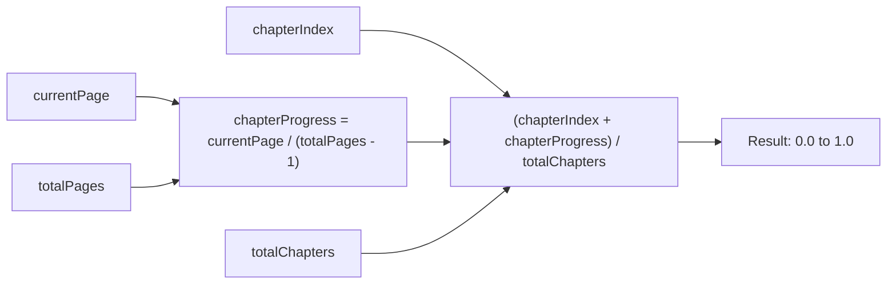

# Architecture

## Module Overview

## Module Responsibilities

| Module | Files | Purpose |
|--------|-------|---------|
| `types/` | `book.ts`, `chapter.ts`, `settings.ts` | Data models, settings interface, theme definitions, font families |
| `api/` | `client.ts`, `content-loader.ts` | HTTP client for book/chapter API, HTML content fetching |
| `renderer/` | `style-injector.ts`, `chapter-renderer.ts` | CSS generation from settings, DOMPurify HTML rendering |
| `core/` | `paginator.ts`, `scroll-mode.ts` | CSS column pagination engine, scroll-based reading mode |
| `navigation/` | `chapter-manager.ts`, `progress.ts` | Chapter traversal state machine, overall reading progress |
| `react/` | `index.tsx` | React Provider, View component, and hooks |

## Data Flow

## CSS Column Pagination

The paginator uses CSS multi-column layout to split content into fixed-width columns, then translates the content container horizontally to show one "page" at a time.

| Property | Value |
|----------|-------|
| Layout | `column-width: calc(100% - margin*2)` |
| Gap | `column-gap: margin*2` |
| Fill | `column-fill: auto` |
| Navigation | `transform: translateX(-currentPage * pageWidth)` |
| Overflow | `overflow: hidden` on viewport |

## Settings & Theme System

### Theme Color Palette

| Theme | Background | Text | Secondary | Highlight | Link |
|-------|-----------|------|-----------|-----------|------|
| Light | `#FFFFFF` | `#1A1A1A` | `#666666` | `#FFD700` | `#2563EB` |
| Sepia | `#F4ECD8` | `#5B4636` | `#8B7355` | `#D4A574` | `#8B4513` |
| Dark | `#1C1C1E` | `#E5E5E7` | `#8E8E93` | `#4A90D9` | `#64B5F6` |
| Ultra Dark | `#000000` | `#E5E5E7` | `#8E8E93` | `#4A90D9` | `#64B5F6` |

### Typography Settings

| Setting | Type | Default | Description |
|---------|------|---------|-------------|
| fontSize | number | 18 | Font size in pixels |
| fontFamily | string | Georgia, serif | CSS font-family value |
| lineHeight | number | 1.6 | Line height multiplier |
| letterSpacing | number | 0 | Letter spacing in pixels |
| wordSpacing | number | 0 | Word spacing in pixels |
| paragraphSpacing | number | 12 | Paragraph bottom margin in pixels |
| textAlign | TextAlign | justify | Text alignment |
| hyphenation | boolean | true | Enable CSS hyphenation |
| theme | ThemeName | light | Active theme |
| readingMode | ReadingMode | paginated | Paginated or scroll mode |
| margin | number | 20 | Content margin in pixels |

## Reading Progress Calculation

