# @readmigo/reader-engine 设计文档

## 目录

- [1. 项目概述](#1-项目概述)
- [2. 设计目标与原则](#2-设计目标与原则)
- [3. 系统架构](#3-系统架构)
- [4. 模块详细设计](#4-模块详细设计)
  - [4.1 类型系统 (types/)](#41-类型系统-types)
  - [4.2 API 层 (api/)](#42-api-层-api)
  - [4.3 渲染器 (renderer/)](#43-渲染器-renderer)
  - [4.4 分页引擎 (core/)](#44-分页引擎-core)
  - [4.5 导航管理 (navigation/)](#45-导航管理-navigation)
  - [4.6 引擎门面 (engine.ts)](#46-引擎门面-enginets)
  - [4.7 React 集成层 (react/)](#47-react-集成层-react)
- [5. 核心机制](#5-核心机制)
  - [5.1 CSS 多列分页](#51-css-多列分页)
  - [5.2 主题与排版系统](#52-主题与排版系统)
  - [5.3 阅读进度计算](#53-阅读进度计算)
  - [5.4 章节自动切换](#54-章节自动切换)
- [6. 数据流](#6-数据流)
- [7. 安全设计](#7-安全设计)
- [8. 错误处理策略](#8-错误处理策略)
- [9. 构建与分发](#9-构建与分发)
- [10. 扩展性设计](#10-扩展性设计)
- [11. 设计决策记录](#11-设计决策记录)

---

## 1. 项目概述

`@readmigo/reader-engine` 是一个基于 CSS 多列布局的书籍章节 HTML 分页引擎，用于在 Web 环境中提供完整的电子书阅读体验。

### 1.1 核心能力

- **HTML 分页**：将章节 HTML 内容通过 CSS `column-width` 布局切割为离散页面，模拟真实翻页体验
- **滚动阅读**：提供连续滚动模式作为分页模式的替代方案，并追踪滚动进度
- **排版控制**：支持字号、字体、行高、字距、词距、段距、对齐方式、连字符等精细排版设置
- **主题系统**：内置四种主题（Light、Sepia、Dark、Ultra Dark），支持动态切换
- **章节导航**：有序遍历、按索引跳转、按 ID 跳转，自动检测边界
- **进度追踪**：结合章节进度和页面进度的综合阅读进度计算（0.0 ~ 1.0）
- **内容安全**：通过 DOMPurify 进行 HTML 净化，防御 XSS 攻击
- **React 集成**：提供 Provider、View 组件和 Hooks，开箱即用

### 1.2 目标用户

| 用户类型 | 使用方式 |
|---------|---------|
| 原生 Web 应用开发者 | 直接使用 `ReaderEngine` 门面类 |
| React 应用开发者 | 使用 `ReaderProvider` + `ReaderView` + Hooks |
| 高级开发者 | 直接使用底层模块（`Paginator`、`ChapterRenderer` 等） |

---

## 2. 设计目标与原则

### 2.1 设计目标

| 目标 | 描述 |
|-----|------|
| **轻量化** | 最小化运行时依赖，仅依赖 `dompurify` 一个运行时库 |
| **框架无关** | 核心引擎不依赖任何 UI 框架，React 集成作为独立入口点提供 |
| **类型安全** | 全部使用 TypeScript 开发，严格模式编译，导出完整的类型声明 |
| **双格式分发** | 同时提供 ESM 和 CJS 格式，适配不同的打包和运行环境 |
| **可组合性** | 每个模块可独立使用，也可通过门面类统一编排 |

### 2.2 设计原则

1. **门面模式（Facade Pattern）**：`ReaderEngine` 作为统一入口，隐藏内部模块的复杂性，提供简洁的公共 API
2. **关注点分离（Separation of Concerns）**：API 通信、DOM 渲染、分页计算、导航管理各自独立
3. **不可变配置传播**：设置变更通过浅拷贝传播到子模块，避免共享可变状态
4. **回调驱动的状态通知**：通过 `callbacks` 对象提供状态变更通知，不强制绑定特定的状态管理方案
5. **渐进增强**：React 集成层为可选依赖（peer dependency），不使用 React 时零额外成本

---

## 3. 系统架构

### 3.1 架构总览

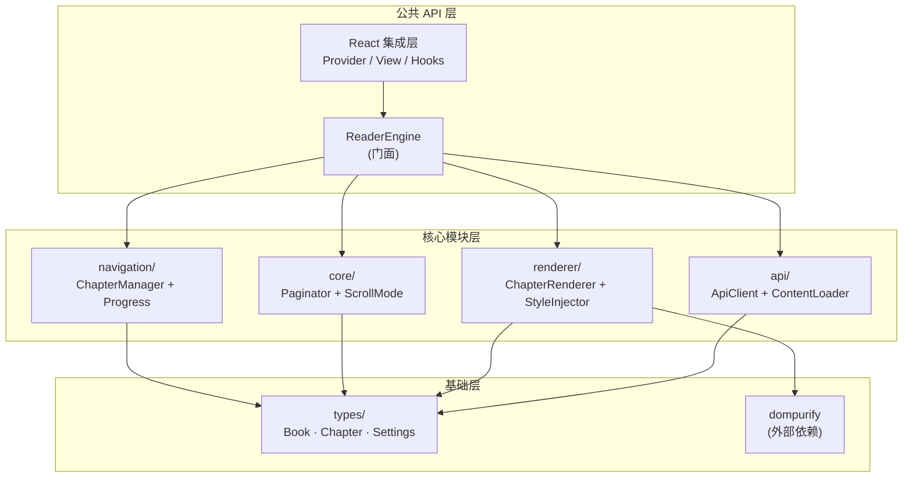
```mermaid
graph TB
    subgraph "公共 API 层"
        RE["ReaderEngine<br/>(门面)"]
        ReactLayer["React 集成层<br/>Provider / View / Hooks"]
    end

    subgraph "核心模块层"
        API["api/<br/>ApiClient + ContentLoader"]
        Renderer["renderer/<br/>ChapterRenderer + StyleInjector"]
        Core["core/<br/>Paginator + ScrollMode"]
        Nav["navigation/<br/>ChapterManager + Progress"]
    end

    subgraph "基础层"
        Types["types/<br/>Book · Chapter · Settings"]
        DOMPurify["dompurify<br/>(外部依赖)"]
    end

    ReactLayer --> RE
    RE --> API
    RE --> Renderer
    RE --> Core
    RE --> Nav

    API --> Types
    Renderer --> Types
    Renderer --> DOMPurify
    Core --> Types
    Nav --> Types
```

### 3.2 分层设计

系统采用三层架构：

| 层级 | 模块 | 职责 |
|-----|------|------|
| **公共 API 层** | `ReaderEngine`、`react/` | 对外暴露的使用接口，屏蔽内部实现细节 |
| **核心模块层** | `api/`、`renderer/`、`core/`、`navigation/` | 各子系统的具体实现，各自独立，通过类型系统协作 |
| **基础层** | `types/`、`dompurify` | 数据模型定义和外部依赖 |

### 3.3 模块依赖关系

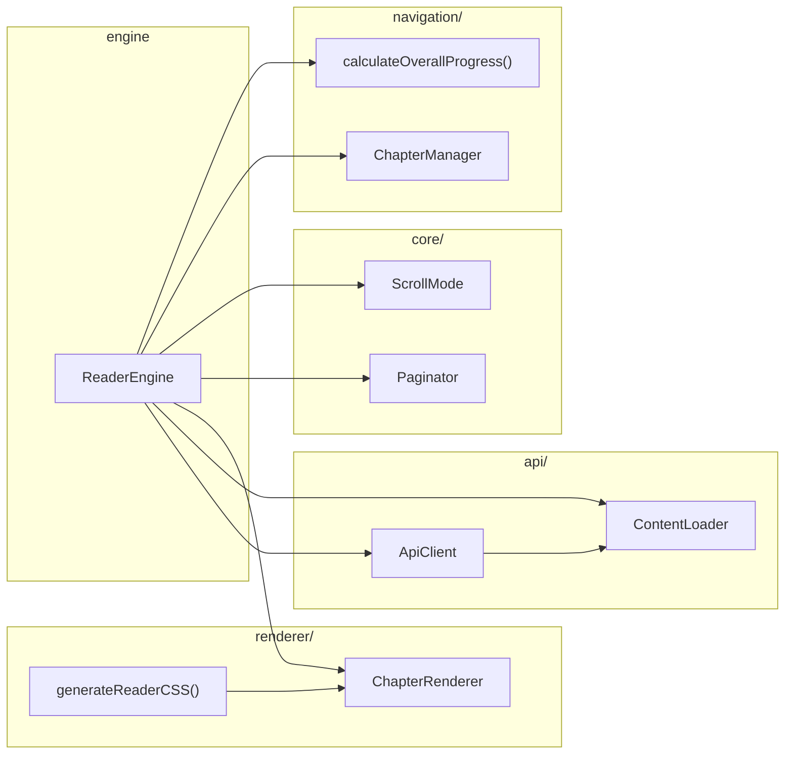
```mermaid
graph LR
    subgraph "api/"
        AC[ApiClient] --> CL[ContentLoader]
    end

    subgraph "renderer/"
        SI["generateReaderCSS()"] --> CR[ChapterRenderer]
    end

    subgraph "core/"
        P[Paginator]
        SM[ScrollMode]
    end

    subgraph "navigation/"
        CM[ChapterManager]
        PR["calculateOverallProgress()"]
    end

    subgraph "engine"
        RE[ReaderEngine]
    end

    RE --> AC
    RE --> CL
    RE --> CR
    RE --> P
    RE --> SM
    RE --> CM
    RE --> PR
```

依赖方向始终向下（高层 → 低层），不存在循环依赖。各核心模块之间互不直接依赖，仅通过共享类型（`types/`）进行数据传递。

---

## 4. 模块详细设计

### 4.1 类型系统 (types/)

类型系统是整个项目的基础，定义了所有模块共享的数据结构。

#### 4.1.1 文件结构

| 文件 | 职责 |
|------|------|
| `book.ts` | 书籍元数据模型：`Book`、`BookDetail`、`ChapterSummary` |
| `chapter.ts` | 章节内容模型：`ChapterContent`、`LoadedChapter` |
| `settings.ts` | 阅读器设置：`ReaderSettings`、主题定义、字体列表 |

#### 4.1.2 核心数据模型

**书籍数据层次**：

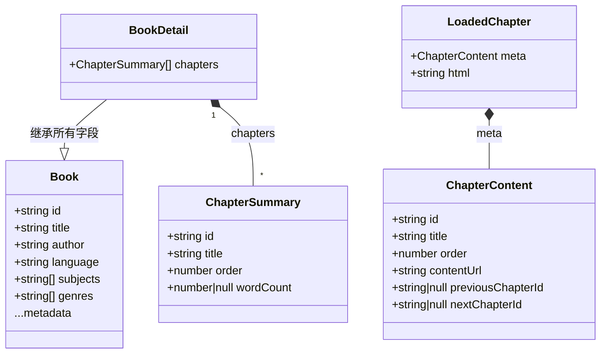
```mermaid
classDiagram
    class Book {
        +string id
        +string title
        +string author
        +string language
        +string[] subjects
        +string[] genres
        ...metadata
    }

    class BookDetail {
        +ChapterSummary[] chapters
    }

    class ChapterSummary {
        +string id
        +string title
        +number order
        +number|null wordCount
    }

    class ChapterContent {
        +string id
        +string title
        +number order
        +string contentUrl
        +string|null previousChapterId
        +string|null nextChapterId
    }

    class LoadedChapter {
        +ChapterContent meta
        +string html
    }

    BookDetail --|> Book : 继承所有字段
    BookDetail "1" *-- "*" ChapterSummary : chapters
    LoadedChapter *-- ChapterContent : meta
```

`Book` 与 `BookDetail` 的区别在于：`BookDetail` 附带章节摘要列表 (`chapters`)。两者的字段在 TypeScript 中分别定义（非继承），确保接口定义清晰可读。

**设置系统**：

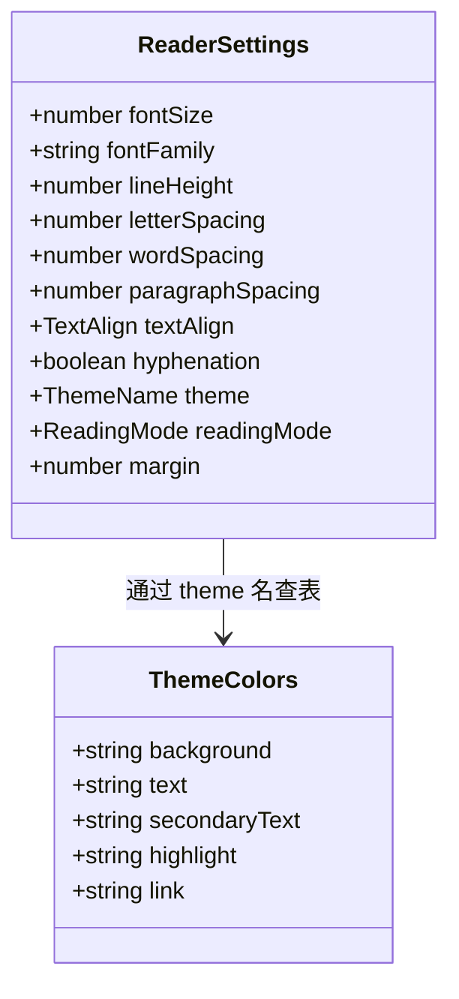
```mermaid
classDiagram
    class ReaderSettings {
        +number fontSize
        +string fontFamily
        +number lineHeight
        +number letterSpacing
        +number wordSpacing
        +number paragraphSpacing
        +TextAlign textAlign
        +boolean hyphenation
        +ThemeName theme
        +ReadingMode readingMode
        +number margin
    }

    class ThemeColors {
        +string background
        +string text
        +string secondaryText
        +string highlight
        +string link
    }

    ReaderSettings --> ThemeColors : 通过 theme 名查表
```

#### 4.1.3 常量定义

| 常量 | 类型 | 用途 |
|-----|------|------|
| `DEFAULT_SETTINGS` | `ReaderSettings` | 阅读器默认设置，作为所有设置的起始值 |
| `THEMES` | `Record<ThemeName, ThemeColors>` | 主题名到颜色方案的映射 |
| `FONT_FAMILIES` | `ReadonlyArray<{name, css}>` | 可选字体列表，提供中西文字体支持 |

#### 4.1.4 设计决策

- 使用 `string | null` 而非 `string?` 表示可选字段，明确区分「字段不存在」与「字段为空」
- `ThemeName` 使用字面量联合类型而非枚举，保持与 JSON 的直接兼容性
- `FONT_FAMILIES` 使用 `as const` 断言，确保类型推断为只读元组

---

### 4.2 API 层 (api/)

API 层负责与后端书籍内容 API 的 HTTP 通信。

#### 4.2.1 ApiClient

`ApiClient` 封装了所有 HTTP 请求逻辑：

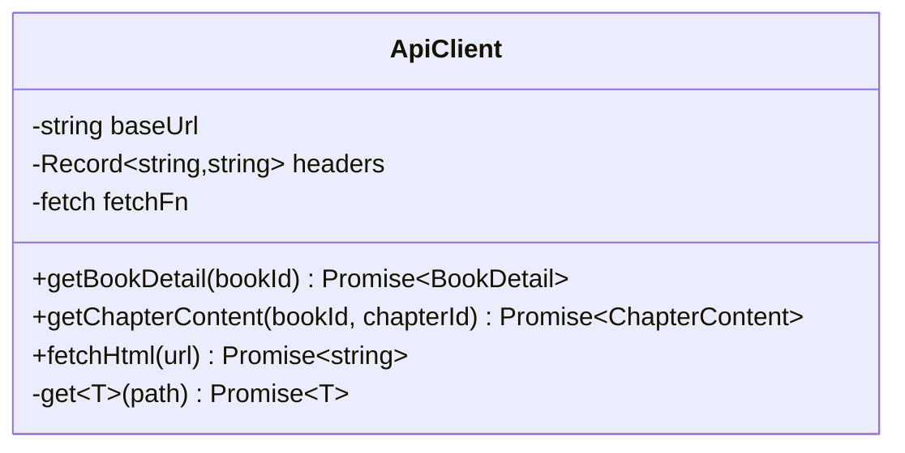
```mermaid
classDiagram
    class ApiClient {
        -string baseUrl
        -Record~string,string~ headers
        -fetch fetchFn
        +getBookDetail(bookId) Promise~BookDetail~
        +getChapterContent(bookId, chapterId) Promise~ChapterContent~
        +fetchHtml(url) Promise~string~
        -get~T~(path) Promise~T~
    }
```

**设计要点**：

| 特性 | 实现 | 原因 |
|-----|------|------|
| 可注入 fetch | 构造函数接受 `fetch` 参数 | 支持 SSR、测试 mock、自定义中间件 |
| 自动尾斜杠处理 | `baseUrl.replace(/\/$/, '')` | 避免路径拼接产生双斜杠 |
| 通用 GET 方法 | `private get<T>(path)` | 集中处理请求头、错误状态码检查 |
| HTML 与 JSON 分离 | `fetchHtml` 独立于 `get<T>` | 章节 HTML 可能由 CDN 提供，URL 不同于 API 基址 |

**API 端点约定**：

| 方法 | 端点 | 响应类型 |
|-----|------|---------|
| `getBookDetail` | `GET /books/{bookId}` | `BookDetail` (JSON) |
| `getChapterContent` | `GET /books/{bookId}/content/{chapterId}` | `ChapterContent` (JSON) |
| `fetchHtml` | `GET {contentUrl}` | 原始 HTML (text) |

#### 4.2.2 ContentLoader

`ContentLoader` 编排章节加载流程，将元数据获取和 HTML 内容获取组合为一个原子操作：

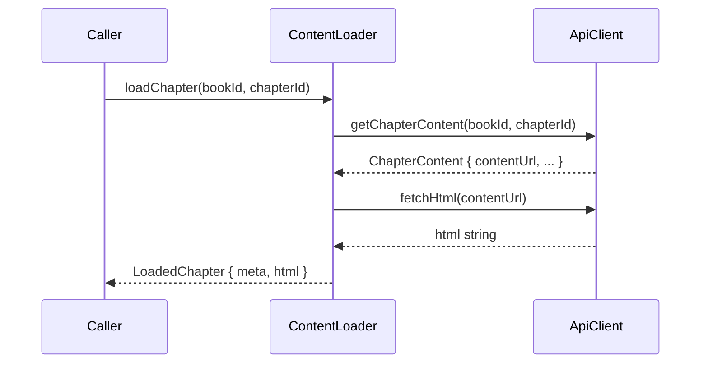
```mermaid
sequenceDiagram
    participant Caller
    participant CL as ContentLoader
    participant AC as ApiClient

    Caller->>CL: loadChapter(bookId, chapterId)
    CL->>AC: getChapterContent(bookId, chapterId)
    AC-->>CL: ChapterContent { contentUrl, ... }
    CL->>AC: fetchHtml(contentUrl)
    AC-->>CL: html string
    CL-->>Caller: LoadedChapter { meta, html }
```

此两步获取设计允许章节元数据（JSON）和章节内容（HTML）分别托管在不同的服务上，例如 API 服务器和 CDN。

---

### 4.3 渲染器 (renderer/)

渲染器负责将 HTML 内容安全地挂载到 DOM，并管理动态样式。

#### 4.3.1 ChapterRenderer

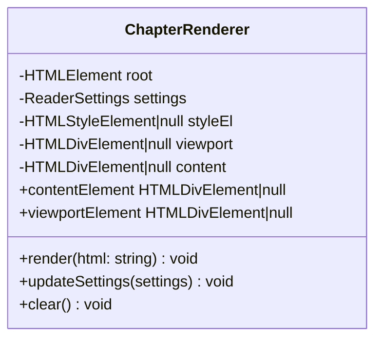
```mermaid
classDiagram
    class ChapterRenderer {
        -HTMLElement root
        -ReaderSettings settings
        -HTMLStyleElement|null styleEl
        -HTMLDivElement|null viewport
        -HTMLDivElement|null content
        +render(html: string) void
        +updateSettings(settings) void
        +clear() void
        +contentElement HTMLDivElement|null
        +viewportElement HTMLDivElement|null
    }
```

**DOM 结构**：

```
root (用户提供的容器)
├── <style> (动态生成的 CSS)
└── .reader-engine-viewport (外层视口)
    └── .reader-engine-content (内容区域，CSS 多列布局)
        └── [sanitized HTML content]
```

**render() 流程**：

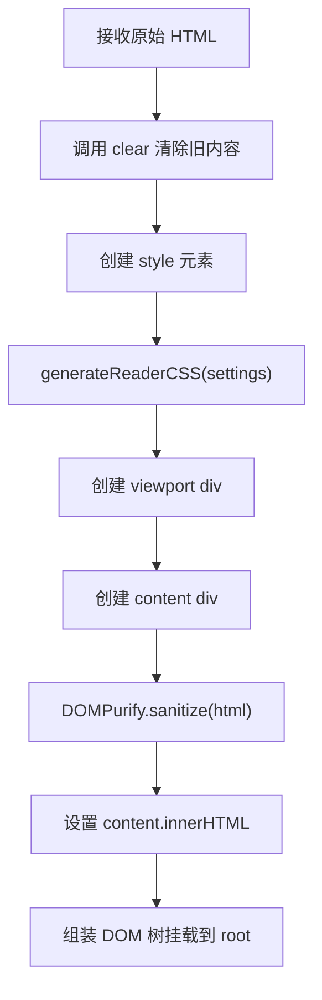
```mermaid
graph TD
    A[接收原始 HTML] --> B[调用 clear 清除旧内容]
    B --> C[创建 style 元素]
    C --> D["generateReaderCSS(settings)"]
    D --> E[创建 viewport div]
    E --> F[创建 content div]
    F --> G["DOMPurify.sanitize(html)"]
    G --> H[设置 content.innerHTML]
    H --> I[组装 DOM 树挂载到 root]
```

**设计要点**：

- 每次 `render()` 都会先 `clear()`，确保无残留 DOM 元素
- `viewport` 设置 `overflow: hidden` + `position: relative`，作为分页器的视口容器
- `content` 元素承载净化后的 HTML，分页模式下使用 CSS 多列布局

#### 4.3.2 generateReaderCSS()

这是一个纯函数，接收 `ReaderSettings`，返回完整的 CSS 样式表字符串。

**生成的 CSS 包含**：

| 部分 | 内容 |
|-----|------|
| CSS 自定义属性 | `--re-bg`、`--re-text`、`--re-link` 等，用于主题色传递 |
| 基础排版 | 字号、行高、字距、词距、对齐、连字符 |
| 元素样式 | `p` 段距、`a` 链接色、`img` 自适应、`blockquote` 引用样式、`pre/code` 代码样式、`table` 表格样式、`figure/figcaption` 图片说明 |
| 标题样式 | `h1`-`h6` 间距和行高 |
| 分隔线 | `hr` 样式 |
| 分页布局 | 仅在 `readingMode === 'paginated'` 时追加 CSS 多列属性 |

**条件性 CSS 生成**：

```typescript
if (settings.readingMode === 'paginated') {
  // 追加 column-width、column-gap、column-fill、height、overflow
}
```

滚动模式下不设置多列属性，内容自然流式布局。

---

### 4.4 分页引擎 (core/)

分页引擎提供两种阅读模式的底层实现。

#### 4.4.1 Paginator（分页模式）

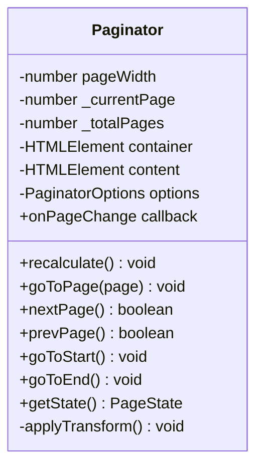
```mermaid
classDiagram
    class Paginator {
        -number pageWidth
        -number _currentPage
        -number _totalPages
        -HTMLElement container
        -HTMLElement content
        -PaginatorOptions options
        +onPageChange callback
        +recalculate() void
        +goToPage(page) void
        +nextPage() boolean
        +prevPage() boolean
        +goToStart() void
        +goToEnd() void
        +getState() PageState
        -applyTransform() void
    }
```

**分页原理**：

```
┌─────────────────────────────────────────────────────┐
│                CSS 多列内容区域                        │
│ ┌──────┐  ┌──────┐  ┌──────┐  ┌──────┐  ┌──────┐   │
│ │ Col1 │  │ Col2 │  │ Col3 │  │ Col4 │  │ Col5 │   │
│ │      │  │      │  │      │  │      │  │      │   │
│ └──────┘  └──────┘  └──────┘  └──────┘  └──────┘   │
└─────────────────────────────────────────────────────┘
       ▲
       │ translateX(-currentPage × pageWidth)
       │
┌──────────┐
│  Viewport │  ← overflow: hidden，只显示一列
│  (可见区域) │
└──────────┘
```

1. CSS `column-width` 将内容自动分割为多列，每列宽度等于视口宽度
2. `column-gap` 设为 `margin × 2`，列间距确保内容不重叠
3. `column-fill: auto` 按顺序填充列，而非均匀分配
4. 页数计算：`totalPages = Math.round(content.scrollWidth / container.clientWidth)`
5. 翻页通过 `transform: translateX(-page × pageWidth)` 实现水平位移

**状态管理**：

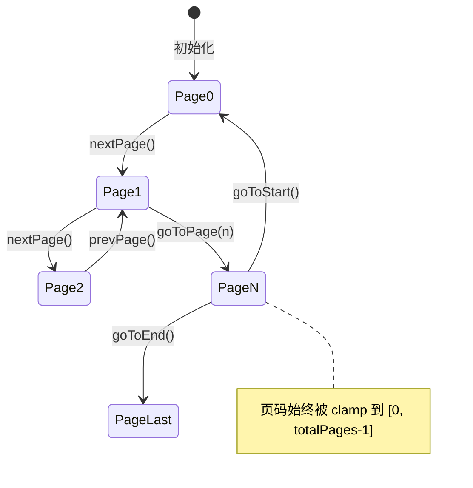
```mermaid
stateDiagram-v2
    [*] --> Page0: 初始化
    Page0 --> Page1: nextPage()
    Page1 --> Page2: nextPage()
    Page2 --> Page1: prevPage()
    Page1 --> PageN: goToPage(n)
    PageN --> Page0: goToStart()
    PageN --> PageLast: goToEnd()

    note right of PageN
        页码始终被 clamp 到 [0, totalPages-1]
    end note
```

**关键方法语义**：

| 方法 | 行为 | 返回 |
|-----|------|------|
| `nextPage()` | 前进一页，已在末页时不操作 | `boolean` 表示是否移动了 |
| `prevPage()` | 后退一页，已在首页时不操作 | `boolean` 表示是否移动了 |
| `goToPage(n)` | 跳转到指定页，自动 clamp | `void` |
| `recalculate()` | 窗口/设置变化后重新计算总页数 | `void` |

#### 4.4.2 ScrollMode（滚动模式）

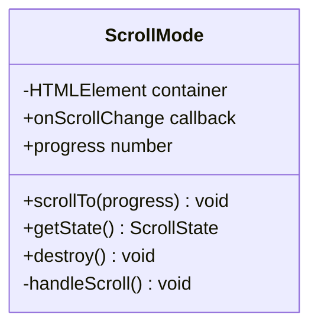
```mermaid
classDiagram
    class ScrollMode {
        -HTMLElement container
        +onScrollChange callback
        +progress number
        +scrollTo(progress) void
        +getState() ScrollState
        +destroy() void
        -handleScroll() void
    }
```

**设计要点**：

- 通过 `{ passive: true }` 选项监听 scroll 事件，不阻塞滚动性能
- 进度计算：`progress = scrollTop / (scrollHeight - clientHeight)`
- 提供 `scrollTo(progress)` 支持从外部设置滚动位置，使用 `behavior: 'smooth'` 平滑滚动
- `destroy()` 方法移除事件监听器，防止内存泄漏

---

### 4.5 导航管理 (navigation/)

#### 4.5.1 ChapterManager

`ChapterManager` 是一个有状态的章节导航状态机，维护有序章节列表和当前阅读位置。

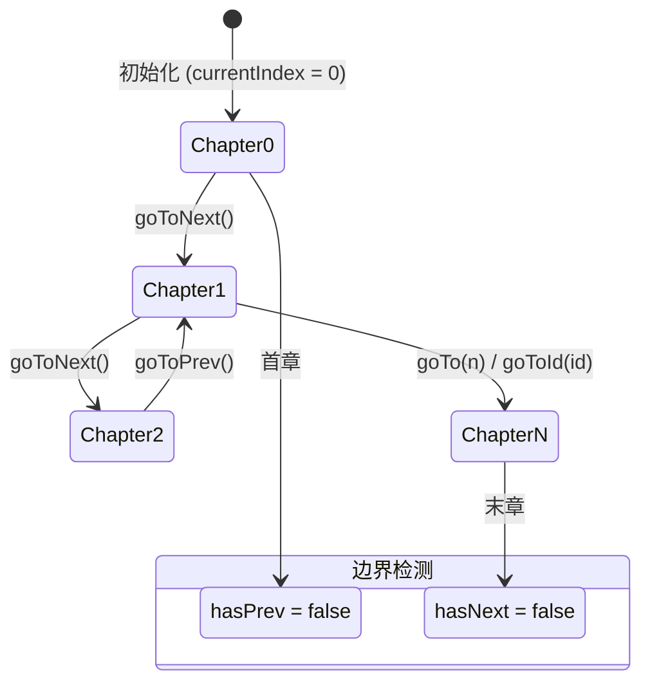
```mermaid
stateDiagram-v2
    [*] --> Chapter0: 初始化 (currentIndex = 0)
    Chapter0 --> Chapter1: goToNext()
    Chapter1 --> Chapter2: goToNext()
    Chapter2 --> Chapter1: goToPrev()
    Chapter1 --> ChapterN: goTo(n) / goToId(id)

    state "边界检测" as BC {
        state "hasPrev = false" as NoPrev
        state "hasNext = false" as NoNext
    }

    Chapter0 --> NoPrev: 首章
    ChapterN --> NoNext: 末章
```

**设计要点**：

| 特性 | 实现 | 原因 |
|-----|------|------|
| 排序保证 | 构造时按 `order` 字段排序 | 后端返回顺序不可靠 |
| 防御性拷贝 | `[...chapters].sort(...)` | 不修改传入的原始数组 |
| 失败返回值 | `goTo()`/`goToId()` 返回 `boolean` | 调用方可根据返回值处理边界 |
| 无越界异常 | 越界索引返回 `false` | 比抛异常更适合 UI 驱动的导航 |

#### 4.5.2 calculateOverallProgress()

这是一个纯函数，计算综合阅读进度：

```
overallProgress = (chapterIndex + chapterProgress) / totalChapters
```

其中：

```
chapterProgress = totalPages > 1 ? currentPage / (totalPages - 1) : 1
```

**边界处理**：

| 场景 | 处理 |
|-----|------|
| `totalChapters <= 0` | 返回 0 |
| 单页章节 (`totalPages <= 1`) | `chapterProgress = 1`（视为已读完） |
| 首页 | `chapterProgress = 0` |
| 末页 | `chapterProgress = 1` |

---

### 4.6 引擎门面 (engine.ts)

`ReaderEngine` 是整个系统的统一入口，编排所有内部模块。

#### 4.6.1 类结构

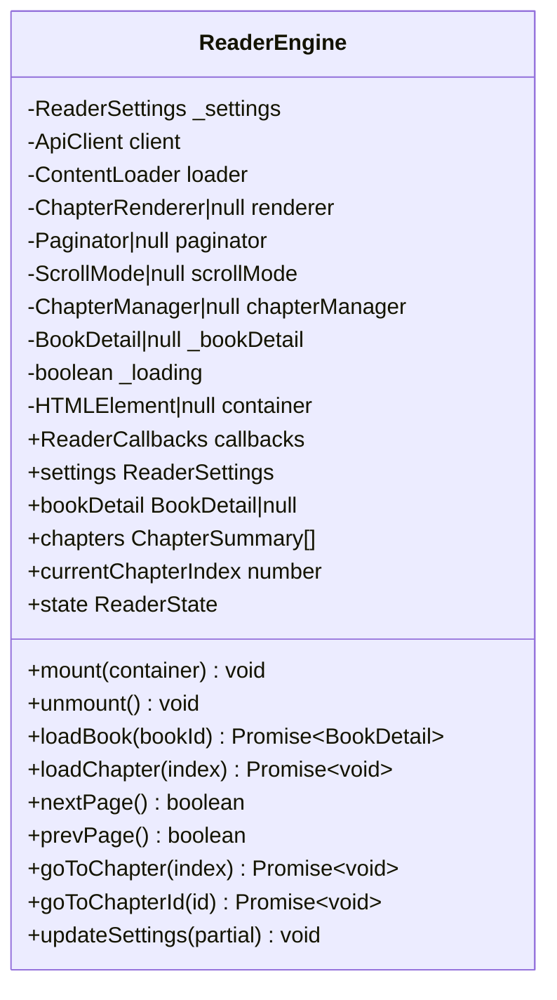
```mermaid
classDiagram
    class ReaderEngine {
        -ReaderSettings _settings
        -ApiClient client
        -ContentLoader loader
        -ChapterRenderer|null renderer
        -Paginator|null paginator
        -ScrollMode|null scrollMode
        -ChapterManager|null chapterManager
        -BookDetail|null _bookDetail
        -boolean _loading
        -HTMLElement|null container

        +ReaderCallbacks callbacks

        +mount(container) void
        +unmount() void
        +loadBook(bookId) Promise~BookDetail~
        +loadChapter(index) Promise~void~
        +nextPage() boolean
        +prevPage() boolean
        +goToChapter(index) Promise~void~
        +goToChapterId(id) Promise~void~
        +updateSettings(partial) void

        +settings ReaderSettings
        +bookDetail BookDetail|null
        +chapters ChapterSummary[]
        +currentChapterIndex number
        +state ReaderState
    }
```

#### 4.6.2 生命周期

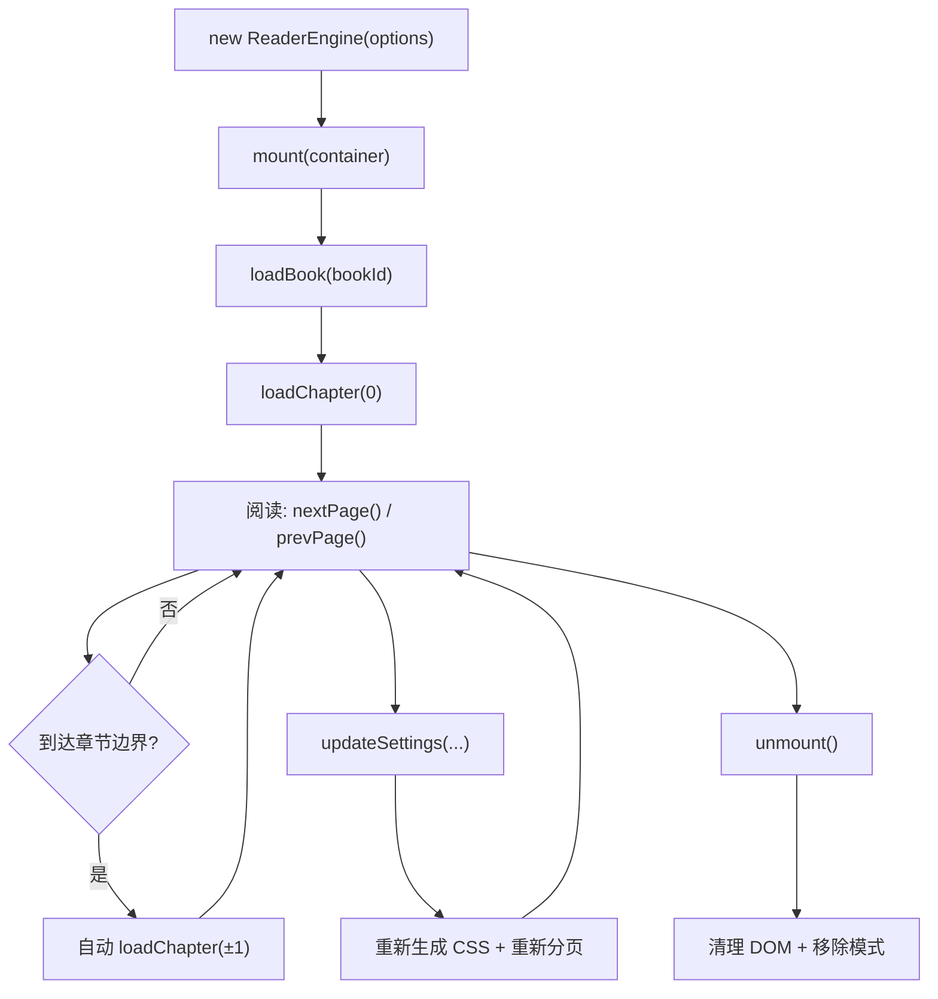
```mermaid
graph TD
    A["new ReaderEngine(options)"] --> B["mount(container)"]
    B --> C["loadBook(bookId)"]
    C --> D["loadChapter(0)"]
    D --> E["阅读: nextPage() / prevPage()"]
    E --> F{"到达章节边界?"}
    F -->|是| G["自动 loadChapter(±1)"]
    G --> E
    F -->|否| E

    E --> H["updateSettings(...)"]
    H --> I["重新生成 CSS + 重新分页"]
    I --> E

    E --> J["unmount()"]
    J --> K["清理 DOM + 移除模式"]
```

#### 4.6.3 ReaderState 快照

`state` 属性返回当前阅读器的完整状态快照（只读）：

```typescript
interface ReaderState {
  bookId: string | null;       // 当前书籍 ID
  chapterIndex: number;        // 当前章节索引
  currentPage: number;         // 当前页码 (0-based)
  totalPages: number;          // 当前章节总页数
  chapterProgress: number;     // 章节内进度 (0~1)
  overallProgress: number;     // 全书进度 (0~1)
  isFirstPage: boolean;        // 是否为章节首页
  isLastPage: boolean;         // 是否为章节末页
  isFirstChapter: boolean;     // 是否为首章
  isLastChapter: boolean;      // 是否为末章
  loading: boolean;            // 是否正在加载
}
```

每次 `state` 被访问时都会基于当前内部状态重新计算，确保数据一致性。

#### 4.6.4 章节自动切换逻辑

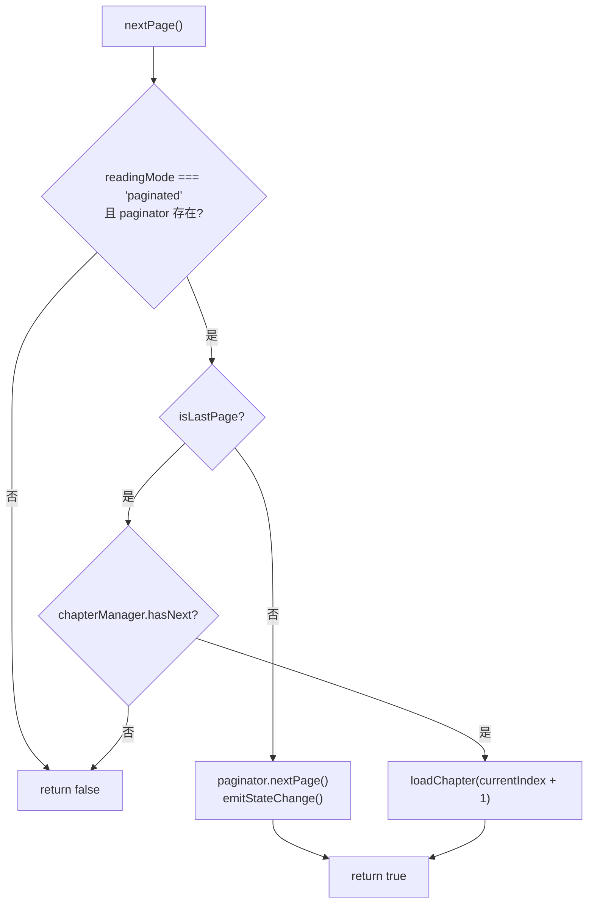
```mermaid
graph TD
    NP["nextPage()"] --> PCheck{"readingMode === 'paginated'<br/>且 paginator 存在?"}
    PCheck -->|否| RetFalse["return false"]
    PCheck -->|是| IsLast{"isLastPage?"}
    IsLast -->|否| Advance["paginator.nextPage()<br/>emitStateChange()"]
    Advance --> RetTrue["return true"]
    IsLast -->|是| HasNext{"chapterManager.hasNext?"}
    HasNext -->|否| RetFalse
    HasNext -->|是| LoadNext["loadChapter(currentIndex + 1)"]
    LoadNext --> RetTrue
```

`prevPage()` 逻辑对称，且在加载前一章后自动跳转到末页（`paginator.goToEnd()`）。

#### 4.6.5 设置更新流程

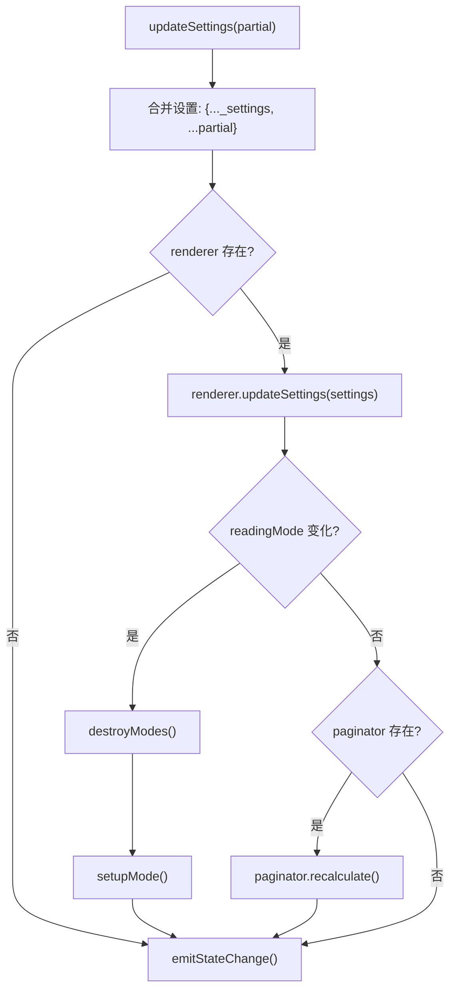
```mermaid
graph TD
    US["updateSettings(partial)"] --> Merge["合并设置: {..._settings, ...partial}"]
    Merge --> HasRenderer{"renderer 存在?"}
    HasRenderer -->|否| Emit["emitStateChange()"]
    HasRenderer -->|是| UpdateCSS["renderer.updateSettings(settings)"]
    UpdateCSS --> ModeChanged{"readingMode 变化?"}
    ModeChanged -->|是| Destroy["destroyModes()"]
    Destroy --> Setup["setupMode()"]
    Setup --> Emit
    ModeChanged -->|否| HasPaginator{"paginator 存在?"}
    HasPaginator -->|是| Recalc["paginator.recalculate()"]
    Recalc --> Emit
    HasPaginator -->|否| Emit
```

---

### 4.7 React 集成层 (react/)

React 集成层通过独立入口 `@readmigo/reader-engine/react` 提供。

#### 4.7.1 架构

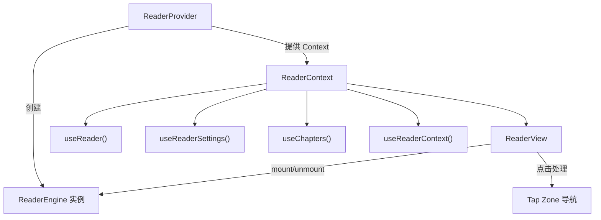
```mermaid
graph TD
    RP["ReaderProvider"] -->|创建| RE["ReaderEngine 实例"]
    RP -->|提供 Context| RC["ReaderContext"]

    RC --> RV["ReaderView"]
    RC --> UR["useReader()"]
    RC --> URS["useReaderSettings()"]
    RC --> UC["useChapters()"]
    RC --> URC["useReaderContext()"]

    RV -->|mount/unmount| RE
    RV -->|点击处理| TZ["Tap Zone 导航"]
```

#### 4.7.2 ReaderProvider

`ReaderProvider` 负责：

1. 创建并持有 `ReaderEngine` 实例（通过 `useRef` 确保实例唯一）
2. 将 `onStateChange` 回调连接到 React 状态（`useState`）
3. 通过 `useCallback` 包装所有操作方法，确保引用稳定
4. 通过 Context 向下传播引擎实例和状态

**状态同步机制**：

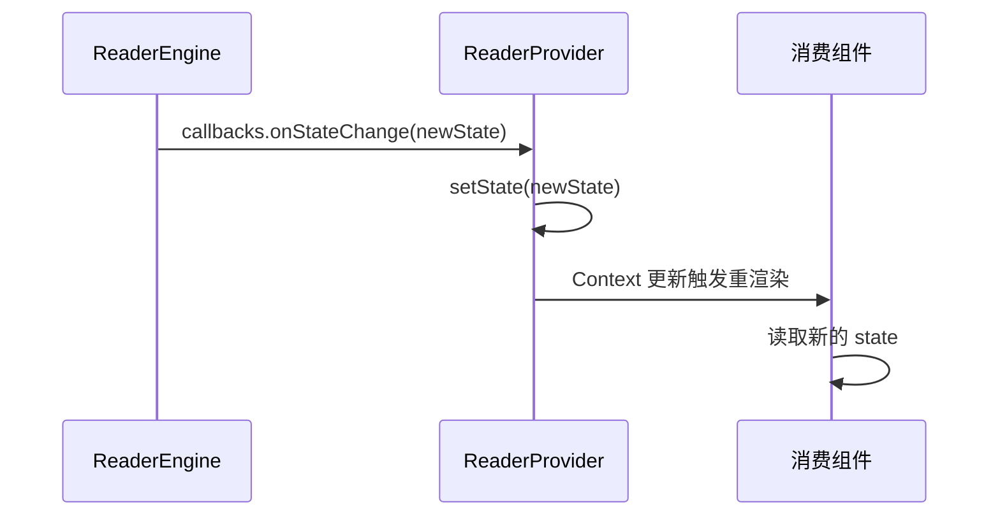
```mermaid
sequenceDiagram
    participant Engine as ReaderEngine
    participant Provider as ReaderProvider
    participant Component as 消费组件

    Engine->>Provider: callbacks.onStateChange(newState)
    Provider->>Provider: setState(newState)
    Provider->>Component: Context 更新触发重渲染
    Component->>Component: 读取新的 state
```

#### 4.7.3 ReaderView

`ReaderView` 是一个渲染阅读器视口的组件：

- 通过 `useRef` 获取 DOM 引用
- 在 `useEffect` 中调用 `engine.mount(el)` / `engine.unmount()`
- 实现基于点击位置的触摸区域导航

**触摸区域布局**：

```
┌──────────┬─────────────────┬──────────┐
│   Left   │     Center      │  Right   │
│   30%    │      40%        │   30%    │
│          │                 │          │
│ prevPage │ onTapCenter回调  │ nextPage │
└──────────┴─────────────────┴──────────┘
```

点击位置判断：

```typescript
const ratio = (clientX - rect.left) / rect.width;
if (ratio < 0.3) { /* 左区 */ }
else if (ratio > 0.7) { /* 右区 */ }
else { /* 中区 */ }
```

#### 4.7.4 Hooks

| Hook | 返回值 | 用途 |
|------|-------|------|
| `useReader()` | `{ state, loadBook, loadChapter, nextPage, prevPage, goToChapter }` | 阅读控制核心 |
| `useReaderSettings()` | `{ settings, updateSettings }` | 设置管理 |
| `useChapters()` | `{ chapters, currentIndex, totalChapters, bookTitle }` | 章节信息 |
| `useReaderContext()` | 完整 `ReaderContextValue` | 高级用法 |

Hooks 设计遵循「功能分组」原则，避免单一巨大 Hook 返回过多数据。

---

## 5. 核心机制

### 5.1 CSS 多列分页

#### 5.1.1 工作原理

CSS 多列布局（CSS Multi-column Layout）是 W3C 标准，允许内容自动分割为多列显示。本项目利用此特性实现分页：

```css
.reader-engine-content {
  column-width: calc(100% - margin*2);  /* 每列宽度 = 视口宽 - 左右边距 */
  column-gap: margin*2;                 /* 列间距 = 左右边距之和 */
  column-fill: auto;                    /* 按顺序填充，不均匀分配 */
  height: 100%;                         /* 固定高度，触发列溢出 */
  overflow: hidden;                     /* 隐藏溢出的列 */
}
```

#### 5.1.2 翻页实现

```
scrollWidth = totalPages × pageWidth
translateX  = -currentPage × pageWidth
```

通过 CSS `transform: translateX()` 实现水平位移，性能优于修改 `scrollLeft`（触发 GPU 合成而非重排）。

#### 5.1.3 页数计算

```typescript
totalPages = Math.max(1, Math.round(content.scrollWidth / container.clientWidth));
```

使用 `Math.round` 而非 `Math.ceil` 是因为 CSS 列布局中 `scrollWidth` 可能存在亚像素精度问题。

#### 5.1.4 重新分页时机

以下操作触发重新分页（`recalculate()`）：

- 更改字号
- 更改字体
- 更改行高
- 更改边距
- 窗口大小变化
- 切换章节内容

### 5.2 主题与排版系统

#### 5.2.1 主题设计

四种内置主题覆盖主流阅读场景：

| 主题 | 背景色 | 文字色 | 适用场景 |
|-----|--------|--------|---------|
| Light | `#FFFFFF` 白色 | `#1A1A1A` 深灰 | 日间阅读，光线充足 |
| Sepia | `#F4ECD8` 暖棕 | `#5B4636` 深棕 | 减轻视觉疲劳 |
| Dark | `#1C1C1E` 深灰 | `#E5E5E7` 浅灰 | 暗光环境 |
| Ultra Dark | `#000000` 纯黑 | `#E5E5E7` 浅灰 | OLED 屏幕，夜间阅读（纯黑省电） |

每个主题定义五种颜色：`background`、`text`、`secondaryText`、`highlight`、`link`。

#### 5.2.2 排版设置

| 设置 | 默认值 | CSS 属性 |
|-----|--------|---------|
| `fontSize` | 18px | `font-size` |
| `fontFamily` | Georgia, serif | `font-family` |
| `lineHeight` | 1.6 | `line-height` |
| `letterSpacing` | 0px | `letter-spacing` |
| `wordSpacing` | 0px | `word-spacing` |
| `paragraphSpacing` | 12px | `p { margin-bottom }` |
| `textAlign` | justify | `text-align` |
| `hyphenation` | true | `hyphens: auto` / `none` |
| `margin` | 20px | 内容内边距 |

#### 5.2.3 CSS 自定义属性

`generateReaderCSS` 生成的 CSS 包含 `:root` 级自定义属性，方便外部样式引用当前主题色：

```css
:root {
  --re-bg: #FFFFFF;
  --re-text: #1A1A1A;
  --re-text-secondary: #666666;
  --re-highlight: #FFD700;
  --re-link: #2563EB;
  --re-font-size: 18px;
  --re-line-height: 1.6;
  --re-margin: 20px;
}
```

### 5.3 阅读进度计算

#### 5.3.1 两级进度模型

进度计算采用两级模型：

```
章节进度 (chapterProgress) = currentPage / (totalPages - 1)
全书进度 (overallProgress) = (chapterIndex + chapterProgress) / totalChapters
```

#### 5.3.2 进度值语义

| 进度值 | 含义 |
|--------|------|
| 0.0 | 全书第一章第一页 |
| 0.5 | 大约阅读到全书中间 |
| 1.0 | 全书最后一章最后一页 |

注意：此计算假设每章篇幅相近。由于各章页数不同，实际进度可能与线性比例有偏差，这是一个合理的简化。

### 5.4 章节自动切换

当用户在翻页时到达章节边界，引擎自动处理章节切换：

**向后翻页**（`nextPage()`）：
1. 当前页不是末页 → 正常翻页
2. 当前页是末页且有下一章 → 自动加载下一章（从首页开始）
3. 当前页是末页且无下一章 → 返回 `false`

**向前翻页**（`prevPage()`）：
1. 当前页不是首页 → 正常翻页
2. 当前页是首页且有上一章 → 加载上一章，加载完成后跳转到末页
3. 当前页是首页且无上一章 → 返回 `false`

---

## 6. 数据流

### 6.1 完整数据流

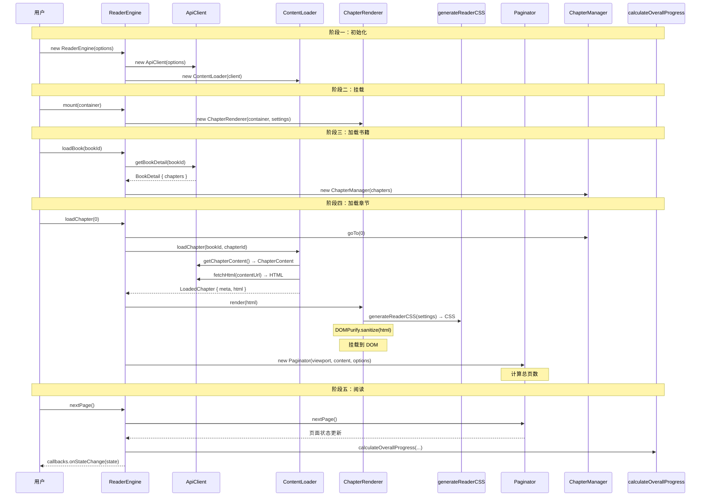
```mermaid
sequenceDiagram
    participant User as 用户
    participant Engine as ReaderEngine
    participant API as ApiClient
    participant CL as ContentLoader
    participant CR as ChapterRenderer
    participant SI as generateReaderCSS
    participant P as Paginator
    participant CM as ChapterManager
    participant PR as calculateOverallProgress

    Note over User,PR: 阶段一：初始化
    User->>Engine: new ReaderEngine(options)
    Engine->>API: new ApiClient(options)
    Engine->>CL: new ContentLoader(client)

    Note over User,PR: 阶段二：挂载
    User->>Engine: mount(container)
    Engine->>CR: new ChapterRenderer(container, settings)

    Note over User,PR: 阶段三：加载书籍
    User->>Engine: loadBook(bookId)
    Engine->>API: getBookDetail(bookId)
    API-->>Engine: BookDetail { chapters }
    Engine->>CM: new ChapterManager(chapters)

    Note over User,PR: 阶段四：加载章节
    User->>Engine: loadChapter(0)
    Engine->>CM: goTo(0)
    Engine->>CL: loadChapter(bookId, chapterId)
    CL->>API: getChapterContent() → ChapterContent
    CL->>API: fetchHtml(contentUrl) → HTML
    CL-->>Engine: LoadedChapter { meta, html }
    Engine->>CR: render(html)
    CR->>SI: generateReaderCSS(settings) → CSS
    Note over CR: DOMPurify.sanitize(html)
    Note over CR: 挂载到 DOM
    Engine->>P: new Paginator(viewport, content, options)
    Note over P: 计算总页数

    Note over User,PR: 阶段五：阅读
    User->>Engine: nextPage()
    Engine->>P: nextPage()
    P-->>Engine: 页面状态更新
    Engine->>PR: calculateOverallProgress(...)
    Engine-->>User: callbacks.onStateChange(state)
```

### 6.2 设置更新数据流

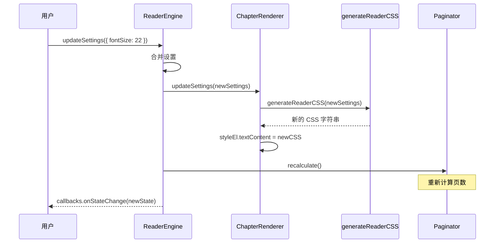
```mermaid
sequenceDiagram
    participant User as 用户
    participant Engine as ReaderEngine
    participant CR as ChapterRenderer
    participant SI as generateReaderCSS
    participant P as Paginator

    User->>Engine: updateSettings({ fontSize: 22 })
    Engine->>Engine: 合并设置
    Engine->>CR: updateSettings(newSettings)
    CR->>SI: generateReaderCSS(newSettings)
    SI-->>CR: 新的 CSS 字符串
    CR->>CR: styleEl.textContent = newCSS
    Engine->>P: recalculate()
    Note over P: 重新计算页数
    Engine-->>User: callbacks.onStateChange(newState)
```

---

## 7. 安全设计

### 7.1 XSS 防护

章节 HTML 内容来自外部 API，存在 XSS 注入风险。系统通过 DOMPurify 进行净化：

```typescript
const sanitized = DOMPurify.sanitize(html, {
  ADD_TAGS: ['figure', 'figcaption'],    // 允许图片说明标签
  ADD_ATTR: ['epub:type'],               // 允许 EPUB 语义属性
});
this.content.innerHTML = sanitized;
```

**净化策略**：

| 方面 | 处理 |
|-----|------|
| Script 标签 | 自动移除 |
| 事件处理器属性 | 自动移除（`onclick`、`onerror` 等） |
| 危险协议 | 自动清理（`javascript:` 等） |
| EPUB 标签 | 保留 `figure`、`figcaption`（电子书常用） |
| 自定义属性 | 保留 `epub:type`（EPUB 语义标注） |

### 7.2 API 安全

- `ApiClient` 支持自定义请求头（`headers`），可用于传递认证令牌
- `fetchHtml` 对非 2xx 响应抛出异常，防止错误内容注入
- 不对 API 响应做 `eval()` 或动态执行

---

## 8. 错误处理策略

### 8.1 错误传播

| 场景 | 处理方式 |
|-----|---------|
| API 请求失败 | 抛出 `Error`，消息含 HTTP 状态码 |
| 书籍未加载时操作 | 抛出 `Error('Book not loaded or engine not mounted')` |
| 无效章节索引 | 抛出 `Error('Invalid chapter index: N')` |
| 章节 ID 未找到 | 抛出 `Error('Chapter not found: id')` |

### 8.2 错误回调

所有异步操作（`loadBook`、`loadChapter`）在 catch 块中调用 `callbacks.onError`，然后重新抛出异常。这确保：

1. 回调通知 UI 层错误已发生
2. `await` 的调用方也能捕获异常

```typescript
try {
  // ... 异步操作
} catch (err) {
  this.callbacks.onError?.(err instanceof Error ? err : new Error(String(err)));
  throw err;
}
```

### 8.3 Loading 状态

`setLoading()` 在 try/finally 中使用，确保无论成功还是失败，loading 状态都会正确重置：

```typescript
this.setLoading(true);
try { /* ... */ } finally { this.setLoading(false); }
```

---

## 9. 构建与分发

### 9.1 构建工具链

| 工具 | 版本 | 用途 |
|-----|------|------|
| TypeScript | ≥5.7 | 类型检查和编译 |
| tsup | ≥8.0 | 打包（基于 esbuild） |
| Vitest | ≥2.0 | 单元测试 |
| happy-dom | ≥15.0 | 测试环境 DOM 模拟 |

### 9.2 输出格式

```
dist/
├── index.js        # ESM 格式核心入口
├── index.cjs       # CJS 格式核心入口
├── index.d.ts      # 类型声明
├── react.js        # ESM 格式 React 入口
├── react.cjs       # CJS 格式 React 入口
└── react.d.ts      # React 类型声明
```

### 9.3 双入口设计

| 入口 | 导入路径 | 内容 |
|-----|---------|------|
| 核心 | `@readmigo/reader-engine` | 引擎、类型、API、渲染器、分页器、导航 |
| React | `@readmigo/reader-engine/react` | Provider、View、Hooks |

React 入口为独立打包，`react` 和 `react-dom` 作为可选 peer dependency。不使用 React 时不会引入任何 React 相关代码。

### 9.4 npm 脚本

| 脚本 | 命令 | 说明 |
|-----|------|------|
| `build` | `tsup` | 生产构建 |
| `dev` | `tsup --watch` | 开发模式，文件变更自动重建 |
| `test` | `vitest run` | 运行测试套件 |
| `test:watch` | `vitest` | 监听模式测试 |
| `lint` | `tsc --noEmit` | TypeScript 类型检查 |

---

## 10. 扩展性设计

### 10.1 当前扩展点

| 扩展点 | 方式 | 说明 |
|--------|------|------|
| 自定义 fetch | `ReaderEngineOptions.fetch` | 注入自定义 HTTP 客户端 |
| 自定义请求头 | `ReaderEngineOptions.apiHeaders` | 添加认证、缓存控制等头 |
| 设置覆盖 | `ReaderEngineOptions.settings` | 覆盖任意默认设置 |
| 状态回调 | `callbacks.onStateChange` | 监听所有状态变化 |
| 错误回调 | `callbacks.onError` | 统一错误处理 |
| 章节切换回调 | `callbacks.onChapterChange` | 监听章节切换事件 |
| 底层模块直接使用 | 各模块独立导出 | 绕过门面，自由组合 |

### 10.2 模块直接使用

所有核心模块通过 `index.ts` 独立导出，支持以下高级用法：

```typescript
// 仅使用分页器
import { Paginator } from '@readmigo/reader-engine';

// 仅使用 CSS 生成
import { generateReaderCSS } from '@readmigo/reader-engine';

// 仅使用章节管理
import { ChapterManager } from '@readmigo/reader-engine';
```

### 10.3 可能的扩展方向

| 方向 | 说明 |
|-----|------|
| 书签系统 | 保存/恢复阅读位置 |
| 高亮标注 | 选中文本高亮和笔记 |
| 文本搜索 | 章节内和全书文本搜索 |
| 离线缓存 | Service Worker + IndexedDB 缓存章节 |
| 自定义主题 | 支持用户自定义颜色方案 |
| 手势导航 | 滑动手势翻页 |
| 键盘导航 | 快捷键支持 |
| TTS 集成 | 文字转语音阅读 |

---

## 11. 设计决策记录

### DR-01: 使用 CSS 多列布局而非虚拟列表

**决策**：使用 CSS `column-width` 布局实现分页。

**备选方案**：
- 虚拟列表（按段落分割）
- Canvas 渲染
- 手动 DOM 分割

**选择原因**：
- CSS 多列是浏览器原生支持的标准特性，排版质量高
- 自动处理图片、表格等跨列元素的断裂
- 支持 CSS 连字符、文本对齐等高级排版
- 性能好，浏览器引擎原生优化

**权衡**：
- 页数计算依赖 `scrollWidth`，可能有亚像素精度问题（使用 `Math.round` 缓解）
- 不支持虚拟化（所有内容都在 DOM 中），超长章节可能有性能影响

### DR-02: Facade 模式作为主 API

**决策**：`ReaderEngine` 作为门面类统一编排所有模块。

**原因**：
- 降低使用者的认知负担，一个类即可完成所有操作
- 封装模块间的协调逻辑（如设置变更后自动重新分页）
- 同时导出底层模块，不限制高级使用场景

### DR-03: 回调而非事件发射器

**决策**：使用简单的回调属性（`callbacks.onStateChange`）而非 EventEmitter。

**原因**：
- 回调模式更轻量，无需额外的事件系统依赖
- 阅读器的事件类型少且固定（状态变更、章节切换、错误），无需动态事件注册
- 与 React 的 props/callback 模式天然契合

### DR-04: DOMPurify 作为唯一运行时依赖

**决策**：仅依赖 `dompurify` 作为运行时依赖。

**原因**：
- HTML 净化是安全刚需，不宜自行实现
- DOMPurify 是业界标准的 XSS 防护库，经过广泛验证
- 保持依赖最小化，减少包体积和供应链风险

### DR-05: React 作为可选 peer dependency

**决策**：React 集成通过独立入口 (`/react`) 提供，`react` 为可选 peer dependency。

**原因**：
- 核心引擎不依赖任何 UI 框架
- 不使用 React 的项目不会引入任何 React 代码
- 独立入口允许 tree-shaking 工具完全剔除 React 相关代码

### DR-06: 状态快照而非响应式状态

**决策**：`state` 属性每次访问都重新计算并返回新对象。

**原因**：
- 避免维护可变状态对象的同步问题
- 每次访问保证数据一致性
- React 集成层通过 `onStateChange` 回调触发 `setState`，配合 React 的不可变状态模型
