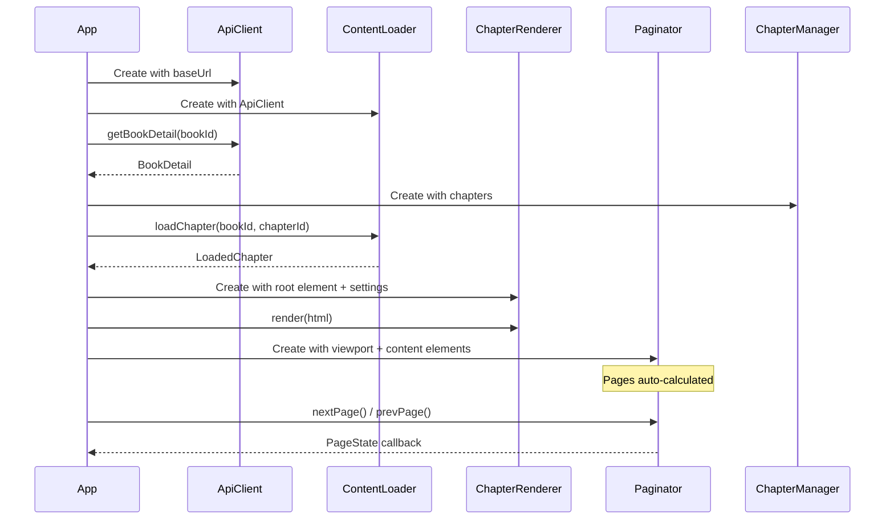
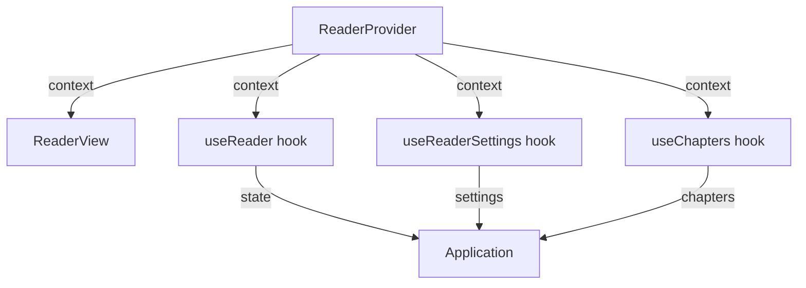
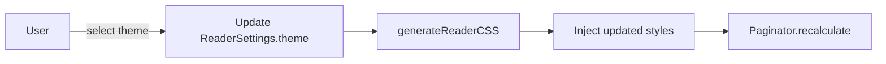
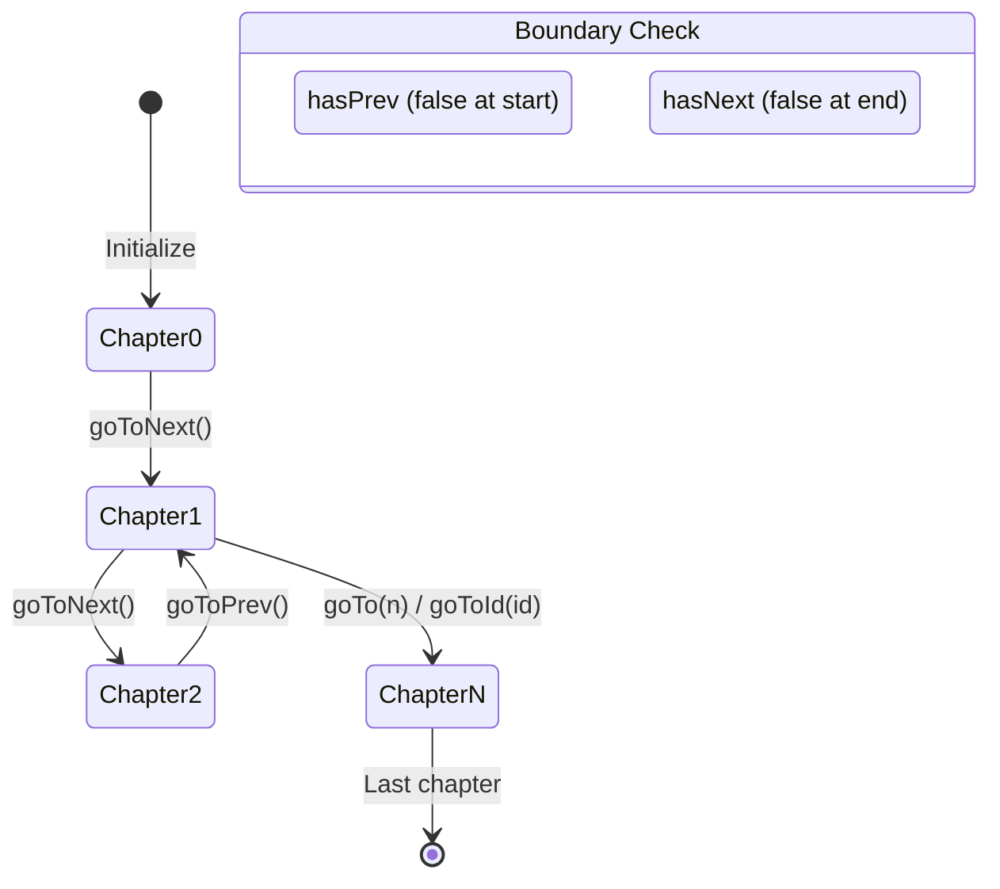

# Getting Started

## Prerequisites

- Node.js >= 18
- npm, yarn, or pnpm
- TypeScript >= 5.7 (for development)

## Installation

```
npm install @readmigo/reader-engine
```

For React integration:

```
npm install @readmigo/reader-engine react react-dom
```

## Module Entry Points

| Import Path | Format | Description |
|------------|--------|-------------|
| `@readmigo/reader-engine` | ESM / CJS | Core engine (types, API, renderer, paginator, navigation) |
| `@readmigo/reader-engine/react` | ESM / CJS | React wrapper (Provider, View, hooks) |

## Integration Flow

### Vanilla TypeScript



### React Integration



## Customizing Settings

Override any field from `DEFAULT_SETTINGS` to customize the reading experience:

| Setting | Effect |
|---------|--------|
| `fontSize` | Adjust text size (triggers re-pagination) |
| `fontFamily` | Change typeface (use values from `FONT_FAMILIES`) |
| `lineHeight` | Adjust vertical spacing |
| `theme` | Switch color scheme (`light`, `sepia`, `dark`, `ultraDark`) |
| `readingMode` | Toggle between `paginated` and `scroll` |
| `textAlign` | Change alignment (`left`, `center`, `right`, `justify`) |
| `hyphenation` | Enable/disable CSS hyphenation |
| `margin` | Adjust content padding |

When settings change, call `ChapterRenderer.updateSettings()` followed by `Paginator.recalculate()` to apply changes and re-paginate.

## Theme Switching



Available themes:

| Theme | Background | Best For |
|-------|-----------|----------|
| Light | White (#FFFFFF) | Daytime reading |
| Sepia | Warm tan (#F4ECD8) | Reduced eye strain |
| Dark | Dark gray (#1C1C1E) | Low-light environments |
| Ultra Dark | Pure black (#000000) | OLED screens / night reading |

## Chapter Navigation



Navigation workflow:

| Step | Action | Result |
|------|--------|--------|
| 1 | Create `ChapterManager` with `BookDetail.chapters` | Chapters sorted by `order` |
| 2 | Use `goToNext()` / `goToPrev()` / `goTo()` / `goToId()` | Returns `boolean` success |
| 3 | Read `currentChapter` to get `ChapterSummary` | Contains `id`, `title`, `order` |
| 4 | Load chapter content via `ContentLoader.loadChapter()` | Returns `LoadedChapter` |
| 5 | Render via `ChapterRenderer.render(html)` | DOM updated |
| 6 | Create new `Paginator` for the new content | Pages recalculated |
| 7 | Call `calculateOverallProgress()` for book-level progress | Returns 0.0 to 1.0 |
