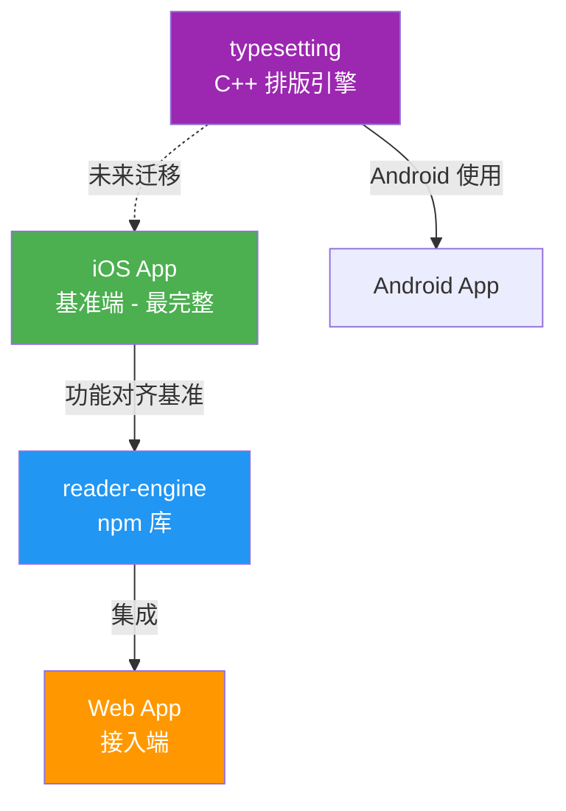

# Reader Feature Alignment Design

> iOS 阅读器为功能基准，reader-engine 作为 npm 库为 Web 端提供核心阅读能力，确保各端功能对齐。

## 项目关系

## 一、排版功能对齐

| 功能 | iOS (基准) | reader-engine | Web | typesetting | 差距 |
|------|-----------|---------------|-----|-------------|------|
| 字体选择 | 11种(含中文3种) + 自定义导入 | 9种(含中文2种,缺楷体) | 3种(serif/sans/mono) | 通过平台层 | Web端字体选择过少，engine缺楷体 |
| 字号 | 4级(17/20/24/28px) | 自由设定 | 12-32px步长2 | 自由设定 | 基本对齐 |
| 字重 | 可调 | 未实现 | 未实现 | Thin~Heavy 7档 | engine/Web缺失 |
| 行间距 | 4级(紧凑/正常/宽松/超宽松) | 自由设定 | 1.2-2.4步长0.2 | 自由设定 | 基本对齐 |
| 字间距 | -2到5,步长0.5 | 有接口 | 固定0,无UI | 有接口 | Web端无调节UI |
| 词间距 | 0到10,步长1 | 有接口 | 固定0,无UI | 有接口 | Web端无调节UI |
| 段间距 | 0到30,步长2 | 有接口 | 固定12,无UI | 有接口 | Web端无调节UI |
| 对齐方式 | 4种 | 4种 | 固定justify | 4种 | Web端无切换UI |
| 首行缩进 | CSS支持 | 未实现 | 未实现 | text-indent | engine缺失 |
| 断字 | 开关 | 开关 | 固定true | 接口(实现TODO) | Web无UI |
| 排版预览 | 实时预览卡片 | 无 | 无 | N/A | engine/Web缺失 |

## 二、翻页模式对齐

| 功能 | iOS (基准) | reader-engine | Web | typesetting | 差距 |
|------|-----------|---------------|-----|-------------|------|
| 垂直滚动 | 有 | ScrollMode | 固定paginated | N/A | Web未开放滚动模式 |
| 左右翻页 | 有 | Paginator | 有 | N/A | 对齐 |
| 淡入淡出 | 有 | 无 | 无 | N/A | 缺失 |
| 3D卷页 | 物理引擎 | 无 | 无 | N/A | 高级功能,Web可不实现 |
| 真实翻页 | 物理仿真+声效+触觉 | 无 | 无 | N/A | 高级功能,Web可不实现 |
| 其他高级(4种) | 有 | 无 | 无 | N/A | 高级功能,Web可不实现 |
| 翻页动画 | 有 | 无transition | 无 | N/A | 建议engine增加基础动画 |
| 手势翻页 | 滑动+点击 | 仅点击区域 | 点击区域 | N/A | engine缺滑动手势 |
| 键盘翻页 | N/A | 无 | 方向键+Space | N/A | engine缺失(Web已实现) |
| 自动翻页 | 15/30/60秒 | 无 | 无 | N/A | 缺失 |

## 三、主题/外观对齐

| 功能 | iOS (基准) | reader-engine | Web | typesetting | 差距 |
|------|-----------|---------------|-----|-------------|------|
| Light主题 | 有 | 有 | 有 | N/A | 对齐 |
| Sepia主题 | 有 | 有 | 有 | N/A | 对齐 |
| Dark主题 | 有 | 有 | 有 | N/A | 对齐 |
| UltraDark主题 | 无 | 有 | 无 | N/A | engine多出,iOS/Web无 |
| 外观模式(跟随系统) | 有 | 无 | 无 | N/A | 缺失 |
| 亮度控制 | 有 | N/A | N/A | N/A | 平台特性 |

## 四、目录功能对齐

| 功能 | iOS (基准) | reader-engine | Web | typesetting | 差距 |
|------|-----------|---------------|-----|-------------|------|
| 章节列表 | 有 | getChapters() | TocPanel | N/A | 对齐 |
| 当前章节高亮 | 有 | currentIndex | 有 | N/A | 对齐 |
| 章节跳转 | 有 | goToChapter/Id | 有 | N/A | 对齐 |
| 嵌套子目录 | 无 | 无 | 二级子目录 | N/A | Web端领先 |
| 章节字数 | 有 | wordCount | 未显示 | N/A | Web端未显示 |

## 五、书签功能对齐

| 功能 | iOS (基准) | reader-engine | Web | typesetting | 差距 |
|------|-----------|---------------|-----|-------------|------|
| 添加/删除书签 | 有 | 无 | 有 | N/A | engine缺失 |
| 书签列表面板 | 分类+搜索+分组 | 无 | 无独立面板 | N/A | engine缺失,Web不完整 |
| 书签编辑 | 标题/笔记/颜色 | 无 | 无 | N/A | 缺失 |
| 后端同步 | 有 | 无 | 乐观更新 | N/A | engine不需要(Web层处理) |
| 离线支持 | 有 | 无 | 离线队列 | N/A | 对齐(Web层) |

## 六、标注/高亮对齐

| 功能 | iOS (基准) | reader-engine | Web | typesetting | 差距 |
|------|-----------|---------------|-----|-------------|------|
| 6色高亮 | 有 | 无 | 有 | N/A | engine缺失 |
| 高亮管理侧边栏 | 有 | 无 | 有 | N/A | engine缺失 |
| 笔记添加/编辑 | 有 | 无 | 有 | N/A | engine缺失 |
| 高亮导航 | 有 | 无 | 有 | N/A | engine缺失 |
| 颜色修改 | 有 | 无 | 有 | N/A | engine缺失 |
| 后端同步 | 有 | 无 | 有 | N/A | Web层处理 |

## 七、搜索功能对齐

| 功能 | iOS (基准) | reader-engine | Web | typesetting | 差距 |
|------|-----------|---------------|-----|-------------|------|
| 全文搜索 | 已禁用(待search index) | 无 | 后端API | N/A | iOS暂时禁用 |
| 搜索结果高亮 | 无 | 无 | mark标签 | N/A | Web端领先 |
| 章节分组 | 无 | 无 | 有 | N/A | Web端领先 |
| 分页加载 | 无 | 无 | 有 | N/A | Web端领先 |

## 八、TTS 朗读对齐 (重点)

| 功能 | iOS (基准) | reader-engine | Web | typesetting | 差距 |
|------|-----------|---------------|-----|-------------|------|
| 基础朗读 | 双引擎(本地+云端) | 无 | Web Speech API | N/A | engine完全缺失 |
| 播放/暂停/停止 | 有 | 无 | 有 | N/A | engine缺失 |
| 上/下一句 | 有 | 无 | 有 | N/A | engine缺失 |
| 语速控制 | 0.5x/1x/1.5x | 无 | 0.5x-2x | N/A | engine缺失 |
| 音调控制 | 0.5-2.0 | 无 | 0.5-2 | N/A | engine缺失 |
| 语音选择 | 按性别筛选 | 无 | 系统语音 | N/A | engine缺失 |
| **句子高亮跟随** | **段落+句子级** | **无** | **无** | N/A | **engine和Web都缺失** |
| 句子间停顿 | 短/正常/长 | 无 | 无 | N/A | 缺失 |
| 段落间停顿 | 短/正常/长 | 无 | 无 | N/A | 缺失 |
| 自动翻页 | 有 | 无 | 无 | N/A | 缺失 |
| 睡眠定时器 | 有 | 无 | 无 | N/A | 缺失 |
| 双击段落跳转朗读 | 有 | 无 | 无 | N/A | 缺失 |
| 选中文本朗读 | 有 | 无 | 有 | N/A | engine缺失 |
| Mini控制条 | N/A | N/A | 有 | N/A | Web特色 |
| 云端语音 | Premium | 无 | 无 | N/A | 平台特性 |

## 九、进度功能对齐

| 功能 | iOS (基准) | reader-engine | Web | typesetting | 差距 |
|------|-----------|---------------|-----|-------------|------|
| 章节内进度 | 有 | 有 | 有 | N/A | 对齐 |
| 全书进度 | 有 | 有 | 有 | N/A | 对齐 |
| 页码显示 | 有 | 有 | 有 | N/A | 对齐 |
| 阅读统计 | 时长/字数/WPM | 无 | 有 | N/A | engine不需要 |
| 里程碑庆祝 | 粒子特效 | 无 | 基础里程碑 | N/A | Web简化版 |
| 进度持久化 | CoreData+API | 无 | API同步 | N/A | engine不需要 |
| 位置恢复 | 有 | 无 | getLastPosition | N/A | engine缺位置恢复API |
| 阅读热力图 | 12周 | 无 | 无 | N/A | 缺失 |
| 每日目标 | 有 | 无 | 无 | N/A | 缺失 |

## 十、Web 端特色功能 (需保留)

| 特色功能 | Web | iOS | 说明 |
|---------|-----|-----|------|
| 宽屏3栏布局 | 待实现(engine支持columns) | 无 | Web独有,需实现 |
| AI助手面板 | 有 | 有 | 两端都有 |
| 段落翻译(双击) | bilingual API | 长按翻译 | 交互方式不同 |
| 生词本 | 有 | 无 | Web独有 |
| 专注模式 | 全屏 | 6种模式(更丰富) | iOS更丰富 |
| 键盘快捷键系统 | 完整 | N/A | Web独有 |
| 多格式(PDF/TXT/MOBI) | 有 | 有 | 对齐 |

## 十一、typesetting 与 reader-engine 对比

| 维度 | typesetting (C++) | reader-engine (TS) |
|------|-------------------|-------------------|
| 排版方式 | 自有排版引擎,输出Page/Line/TextRun坐标 | CSS columns + DOM渲染 |
| 字体度量 | 平台适配器(CoreText/JNI) | 浏览器原生 |
| CSS解析 | 自有CSS解析器(选择器+优先级) | DOMPurify+浏览器原生CSS |
| 平台支持 | iOS(CoreText) + Android(JNI) | Web(浏览器) |
| 首行缩进 | 有 | 无 |
| 表格 | 无 | 浏览器原生 |
| 分栏 | 无 | CSS columns |

## 关键差距总结与优先级

### P0 - 必须对齐

1. **TTS 句子高亮跟随** - iOS有段落+句子级高亮，reader-engine和Web完全缺失
2. **宽屏多栏布局** - engine支持columns但Web未传参数，需完善

### P1 - 核心功能缺口

3. **reader-engine 缺书签API** - Web层自行实现，但engine应提供位置标记能力
4. **reader-engine 缺标注/高亮API** - Web层通过DOM自行处理
5. **reader-engine 缺搜索API** - Web依赖后端搜索
6. **翻页动画** - engine无任何transition，体验粗糙
7. **滑动手势翻页** - engine仅支持点击区域
8. **阅读位置恢复** - engine无位置保存/恢复接口

### P2 - 排版完善

9. **首行缩进** - iOS和typesetting有，engine缺失
10. **字重控制** - iOS和typesetting有，engine缺失
11. **Web端排版设置UI不完整** - 字间距/词间距/段间距/对齐方式均硬编码无UI
12. **字体选择** - Web仅3种 vs iOS 11种

### P3 - 增强功能

13. **自动翻页** - iOS有，其他端缺失
14. **TTS句子间/段落间停顿控制** - iOS有
15. **TTS自动翻页** - iOS有
16. **外观模式(跟随系统)** - iOS有
17. **排版实时预览** - iOS有
